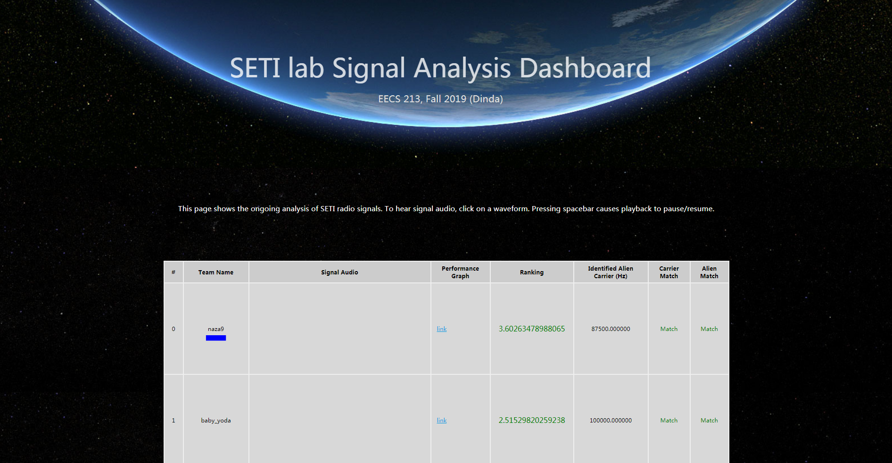

# Title

In	this	lab,	you	will	tackle	a	greatly	simplified	and	constrained	version	of	this	computation,	with	the	goal	
of	trying	to	make	your	computer execute	the	computation	as	fast	as	it	can. You	will	write	a	program	
that,	given	a	raw	signal	from	a	broadband	receiver,	will	try	to	hunt	for signs	of	intelligence4 within	it,	
specifically	some	kind	of	message.	

## Acceleration Method

- **Using the	Intel/AMD	SSE or	AVX vector	instructions or	other	special	instructions**	to	get	
parallelism	within	a	single	thread	of	execution.			Vector	instructions	operate	on	lots	of	data	at	
once.		To	implement	this,	you	will	probably	need	to	learn	about	inline	assembly,	or	learn	how	to	
get	a	compiler	like	icc	to	try	to	vectorize	your	code.
- **Investigate	compiler	optimizations**,	including	those	that	are	specific	to	the	machine	you	are	
running on.			See	if	the	compiler	can	improve	performance	for	you.			gcc	has	hundreds of	
optimization	features	you	can	enable/disable	from	the	command	line.	 You	can	also	try	Intel’s	C	
compiler,	icc.			icc is	likely	to	produce	much	faster	code given	the	right	options.		
- **Parallelize	using	OpenMP.**			OpenMP	is	an extension	to	C/C++	and	other	languages	that	allows	
shared	memory	parallelization	without	explicitly	creating	threads.			It	is	available	in	gcc	and	icc.			
Read	about	OpenMP and	parallelize	the	sequential	code	in	band_scan.c using	it.			
- **Loop unrolling**
- **Remove branch**

## Result

